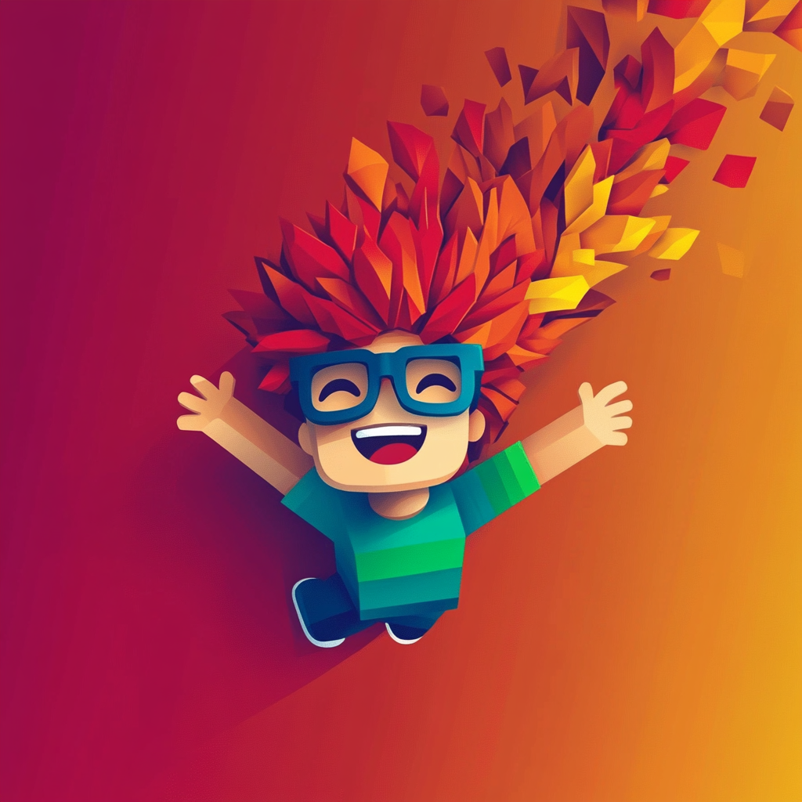

<h3 align="center">
    
     
    Zone Wars
</h3>

    A casual game with a soothing Catppuccin color palette 🎨

    

&nbsp;

## ❤️ Gratitude

This project is based on and heavily inspired by:

-   🎨 [Catppuccin](https://catppuccin.com): A community-driven pastel color palette
-   🎧 [kenney.nl](https://kenney.nl): Thousands of free game assets
-   😜 [Microsoft Fluent Emoji](https://github.com/microsoft/fluentui-emoji): A collection of emoji, used in badges

&nbsp;

## Economy and Pricing

### Money sources (server)

-   **Area milestones**: rewards scale by milestone size (see `SCORE_REWARDS` in `src/server/rewards/services/rewards.ts`)
-   **Ranking (per life)**: Top 1/2/3 grant one-time rewards (see `RANK_REWARDS`)
-   **Passive while top 3**: Periodic income while staying in top 1/2/3 (see `RANK_REWARDS_PASSIVE`)
-   **Eliminations**: Kill bounty based on enemy polygon area size
-   **Premium bonus**: All money grants are multiplied by `PREMIUM_BENEFIT` (currently `1.2`)

### Skin pricing (client/shared)

-   **Tint-only skins**: Free (default look variants)
-   **Part-based skins**: Priced by perceived rarity/appeal and game progression
-   Prices live in `src/shared/constants/skins/skins.ts`

Current part skin prices:

-   Gradient: CosmicShift 300, MidNightCity 450, BradyFun 600, Rastafari 750, SweetMorning 900, JoyShine 1050, Superman 1200
-   Textured: Stars 1400, Spiderweb 1600, Famous 1800, Wood 2000, Stone 2300, Icy 2600

### Pricing strategy

-   **Goal**: One meaningful purchase per solid session early on; sustained goals later
-   **Anchors**: Early milestones (25k–100k area) yield 250–1000; advanced milestones reach 28k+
-   **Premium**: +20% benefits ensure faster but not trivial progression

### Future option: exponential progression

If players commonly afford multiple skins per match, increase scarcity with exponential tiers:

-   Define tier index `t` for each purchasable skin (low → high rarity)
-   Use a geometric series: `price(t) = round(base * growth^t, step)`
    -   Example: `base = 250`, `growth = 1.6`, `step = 50`
    -   Map existing skins to tiers, then re-gen prices
-   Keep tint-only skins at `0`

This keeps early purchases attainable while pushing later skins into mid/high goals, aligning with milestone and bounty growth. Apply after observing live economy data to avoid over-tuning.
